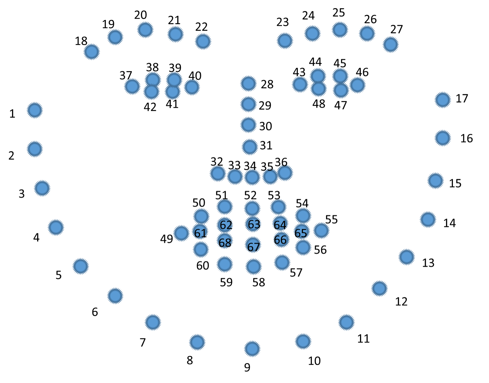
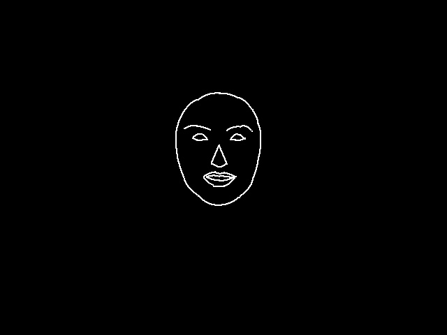
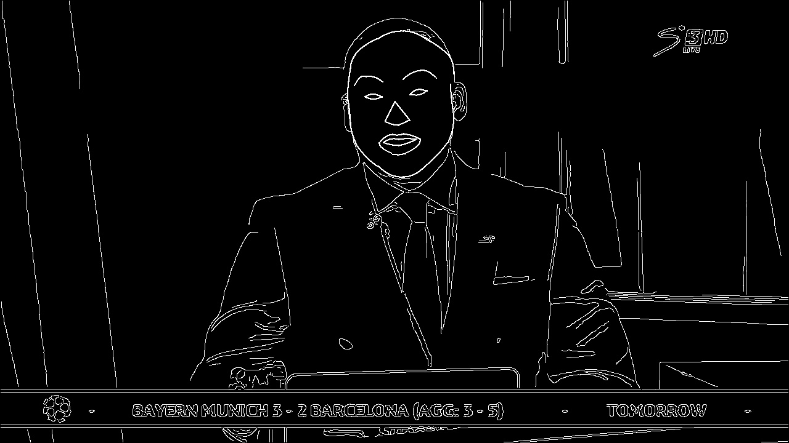

# 笔记

## 配置环境

创建v2v conda环境并启动
```
$ conda create -n v2v python=3.6
$ conda activate v2v
```

安装必要的包
```
$ pip install dominate requests
$ pip install pytz
$ pip install dlib
$ pip install numpy==1.16.2
$ pip install scipy
$ pip install scikit-image
$ pip install opencv-python
$ pip install torch==1.2.0 torchvision==0.4.0
```

运行测试人脸demo
```
# flownet2相关两条
$ python scripts/download_models_flownet2.py
$ python scripts/download_flownet2.py
$ python scripts/download_datasets.py
$ python scripts/face/download_models.py
$ bash ./scripts/face/test_512.sh
```

生成的人脸位于：./results/edge2face_512/test_latest/

首先，进行人脸检测

## 算法描述

> 以edge2face为例，描述算法。

### Dataloader

训练、测试的人脸图像位于datasets/face下，首先进行人脸特征点提取

```
$ python data/face_landmark_detection.py train
```

难点记录：

face_dataset.py定义了人脸图像数据集，getitem函数中有几个不好理解的点记录如下：

首先第一个函数get_video_params，这个函数返回的是我们从当前序列取多少帧（n_frames_total），当前序列的起始index（start_index）和t_step，这个t_step比较有意思，它指的是两个相邻帧的时间间隔，比如序列[1,2,3,4,5,6,7,8,9]，如果t_step是1，则1和2是相邻帧，5和6是相邻帧等等，但如果t_step是2，则1和3是相邻帧，其实这时候序列变成了[1,3,5,7,9]相当于丢掉了一些帧！

该工程采用dlib进行人脸检测，dlib 68点的人脸关键点定义如下：


我添加了在人脸绘制特征点的代码，生成的带关键点的人脸位于：./datasets/face/train_debug/


则训练集位于datasets/face/train_img和datasets/face/train_keypoints，data/face_dataset.py定义了这些数据应该如何读取。

read_keypoints函数记录：

这个函数返回了keypoints, part_list, part_labels，如下一个一个解释

part_list定义了人脸不同的区域，keypoints有83个点（68 + 15），这15个点是将2 - 16点进行了镜像（但是扁了2/3）。具体代码就是以下代码，可以参考我注释理解：

```
pts = keypoints[:17, :].astype(np.int32)
baseline_y = (pts[0,1] + pts[-1,1]) / 2
upper_pts = pts[1:-1,:].copy()
upper_pts[:,1] = baseline_y + (baseline_y-upper_pts[:,1]) * 2 // 3
keypoints = np.vstack((keypoints, upper_pts[::-1,:]))
```

part_labels就是根据part_list给人脸不同区域标记不同label的图像，不同的label定义在label_list = [1, 2, 2, 3, 4, 4, 5, 6]，这里我再debug的时候给放大了30倍为了方便可视化，label_list = [i * 30 for i in label_list]。

然后如下for循环就是遍历part_list给不同区域打不同label的代码：

```
for p, edge_list in enumerate(part_list):
```

debug时我写入了一个图像：

```
cv2.imwrite('face_part.jpg', part_labels)
```


接下来draw_face_edges函数提取了人脸的edge（im_edges）和distance transform maps（dist_tensor），distance transform常用来做分割，原理很简单，就是计算binary image中每一个非零像素点距最近的零像素点的距离。

看draw_face_edges内部。

首先edge_len标明用几个点确定一个边缘。for循环所有人脸part

```
for i in range(0, max(1, len(edge)-1), edge_len-1):
```

这里是制造每一个边缘的起点index的实现，序列类似[0, 2, 4, 6]，表示第一个循环起点是0，则取的点即edge[0:2]，得到三个点的下标，就可以interpPoints这三个点（你和内部用了二次函数拟合，不深究，感觉有更好的实现方式），插值好之后，将边缘画到im_edges

```
drawEdge(im_edges, curve_x, curve_y)
```

这里im_edges一直没有重置，所以所有的人脸part都会画到im_edge里，如下图所示：



后面add_dist_map这个bool控制是否在输入中加入distance transform的channel，edge2face任务中是要加的，而且每一个人脸的小part（比如左右眼不属于同一part）都要计算各自的distance transform，这样的part共有14个，每一个小part的计算基于之前画出的im_edge，注意这里不是im_edges！这样每一个im_dist反应了各自边缘的distance transform情况，im_dist如下图所示：


这是人脸轮廓的dist图。

将14个im_dist concat在一起，形成的dist_tensor的shape是[14, 512, 512]。

再回到get_face_image函数，

我们刚刚得到了人脸的edge图，但是背景的edge图还没有，背景我们使用canny edge检测其边缘（对全图做canny，然后去掉人脸区域），再和人脸区域相加，得到的最后的全图edge如下图所示：



最后将edges、dist maps和part_labels都根据之前计算的人脸ROI进行crop以及相应的transform。

最后input_tensor的shape为[15, 512, 512]，channel1 为edges，channel2 - 15为dist maps，label_tensor为[512, 512]

再回到__getitem__函数，

Ai, Li就是刚才返回的input_tensor和label_tensor，Bi是真实的图像，也进行crop以及transform。

然后将frame concat在一起，最后A的shape为[num_frames * 15, 512, 512]，B的shape为[num_frames * 3, 512, 512]，I的shape为[num_frames * 1, 512, 512]。

## 训练

```
sh ./scripts/face/train_512.sh
```

## TODO

- [ ] 将dlib替换成更好的人脸关键点检测算法
- [x] placeholder